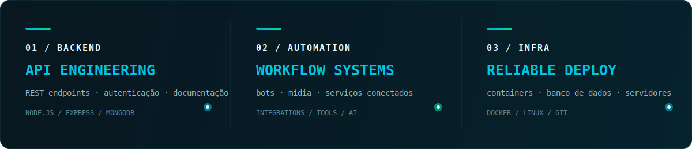
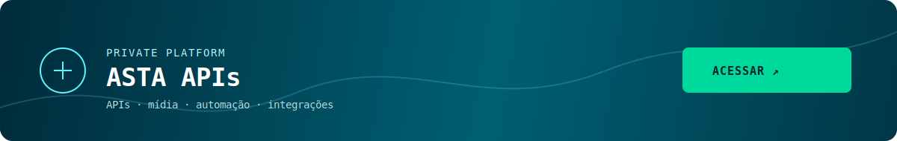

  

 

  

## Stack

  

 

  

 

  
<b>Mais sobre o que construo</b>

   

  APIs para bots e aplicações web, ferramentas de mídia, integrações com serviços externos, automação e recursos baseados em IA.

 

  BUILD WITH PURPOSE · SHIP WITH CONFIDENCE

