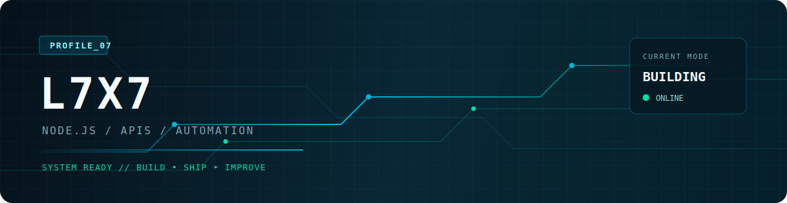

<div align="center">
  

  <br />

  
  
  
</div>

<br />

```console
$ profile --summary

> Desenvolvedor de Node.js focado em APIs REST, automação e integrações.
> Criando ferramentas diretas para bots, aplicações web e projetos reais.
```

<div align="center">

| `BACKEND` | `AUTOMAÇÃO` | `INFRA` |
| :---: | :---: | :---: |
| Node.js · Express · REST | Bots · mídia · integrações | Docker · MongoDB · Linux |

</div>

## // stack

<div align="center">
  
</div>

## // projeto ativo

<div align="center">
  <a href="https://asta-apis.eu.cc">
    
  </a>
</div>

<br />

> **Asta APIs** é uma plataforma privada de APIs, ferramentas de mídia e automações feita para integrações simples e diretas.

<details>
  <summary><b>▸ Explorar especialidades</b></summary>
  <br />

  - APIs para bots e aplicações web
  - Download e processamento de mídia
  - Integrações com serviços externos
  - Ferramentas com IA e automação
</details>

<details>
  <summary><b>▸ Filosofia</b></summary>
  <br />

  `Menos fricção para integrar. Mais valor entregue por endpoint.`
</details>

<br />

<div align="center">
  <a href="https://github.com/Lucas7X7"></a>
</div>

<br />

<div align="center">
  <sub>BUILD • SHIP • IMPROVE</sub>
</div>
